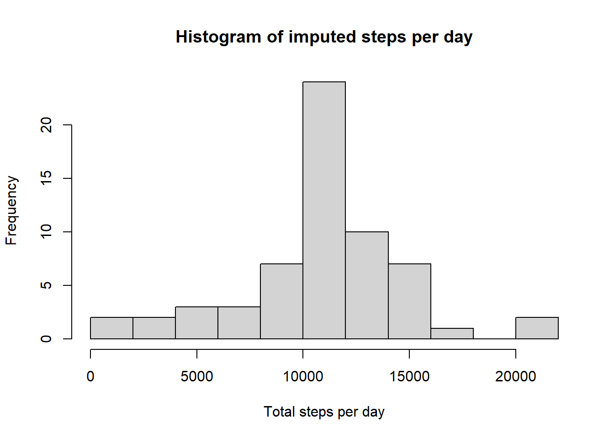

## Loading and processing the dataset

``` r
activity <- read.csv("activity.csv", header=TRUE)
```

## What is the mean total number of steps taken per day?

``` r
##Mean total number of steps taken per day
total_steps <- aggregate(activity$steps, 
                         by = list(activity$date), 
                         FUN = function(x) sum(x, na.rm = TRUE))

colnames(total_steps) <- c("date", "steps")

#Histogram of the total number of steps taken each day
hist(total_steps$steps,breaks=10, main="Histogram of total steps per day", xlab="Total steps per day", ylab="Frequency")
```


``` r
##Mean and median of the total number of steps taken per day 
mean_steps_per_day <- mean(total_steps$steps, na.rm=TRUE)
cat("The mean number of steps per day is:", mean_steps_per_day, "\n")
```

```
## The mean number of steps per day is: 9354.23
```

``` r
median_steps_per_day <- median(total_steps$steps, na.rm = TRUE)
cat("The median number of steps per day is:", median_steps_per_day, "\n")
```

```
## The median number of steps per day is: 10395
```
## What is the average daily activity pattern?

``` r
library(ggplot2)
mean_steps_by_interval <- aggregate(activity$steps, 
                         by = list(activity$interval), 
                         FUN = function(x) mean(x, na.rm = TRUE))

colnames(mean_steps_by_interval)<- c("interval", "steps")

plot(mean_steps_by_interval$interval,
     mean_steps_by_interval$steps,
     type = "l",
     xlab = "5-minute Interval", 
     ylab = "Average Number of Steps Taken",
     main = "Average Daily Activity Pattern")
```


``` r
#The 5-minute interval on average across all the days in the dataset that contains the maximum number of steps
max_inteval <- mean_steps_by_interval$interval[which.max(mean_steps_by_interval$steps)]
cat("The 5-minute interval on average across all the days in the dataset that contains the maximum number of steps is: ", max_inteval)
```

```
## The 5-minute interval on average across all the days in the dataset that contains the maximum number of steps is:  835
```
## Imputing Missing Values

``` r
#total numebr of missing values in the dataset
missing_values <- sum(is.na(activity$steps)==TRUE)
cat("There are", missing_values, "missing values in the dataset")
```

```
## There are 2304 missing values in the dataset
```

``` r
# Strategy for imputing: replace missing values with average for the 5-minute interval
cat("The strategy used is to replace missing 'steps' values with the mean number of steps for that specific 5-minute interval.\n")
```

```
## The strategy used is to replace missing 'steps' values with the mean number of steps for that specific 5-minute interval.
```

``` r
# Impute missing values using interval averages
impute_missing_values <- transform(activity, 
                                   steps = ifelse(is.na(steps),
                                                  mean_steps_by_interval$steps[match(interval, mean_steps_by_interval$interval)],
                                                  steps))


# Preview imputed data
head(impute_missing_values, n=10)
```

```
##        steps       date interval
## 1  1.7169811 2012-10-01        0
## 2  0.3396226 2012-10-01        5
## 3  0.1320755 2012-10-01       10
## 4  0.1509434 2012-10-01       15
## 5  0.0754717 2012-10-01       20
## 6  2.0943396 2012-10-01       25
## 7  0.5283019 2012-10-01       30
## 8  0.8679245 2012-10-01       35
## 9  0.0000000 2012-10-01       40
## 10 1.4716981 2012-10-01       45
```


``` r
# Recalculate total steps per day for imputed dataset
impute_total_steps <- aggregate(impute_missing_values$steps, 
                         by = list(impute_missing_values$date), 
                         FUN = function(x) sum(x, na.rm = TRUE)) 
colnames(impute_total_steps) <- c("date", "steps")


# Histogram of imputed total steps
hist(impute_total_steps$steps,
     breaks=10, 
     main="Histogram of imputed steps per day", 
     xlab="Total steps per day", ylab="Frequency")
```



``` r
# Mean and median after imputation 
impute_mean_steps_per_day <- mean(impute_total_steps$steps, na.rm=TRUE)
cat("The mean number of steps per day is:", impute_mean_steps_per_day, "\n")
```

```
## The mean number of steps per day is: 10766.19
```

``` r
impute_median_steps_per_day <- median(impute_total_steps$steps, na.rm = TRUE)
cat("The median number of steps per day is:", impute_median_steps_per_day, "\n")
```

```
## The median number of steps per day is: 10766.19
```

``` r
#Differences
difference_mean = impute_mean_steps_per_day - mean_steps_per_day
cat("There is a difference of ", difference_mean, "in the mean of the two dataset", "\n")
```

```
## There is a difference of  1411.959 in the mean of the two dataset
```

``` r
difference_median = impute_median_steps_per_day - median_steps_per_day
cat("There is a difference of ", difference_median, "in the median of the two dataset",  "\n")
```

```
## There is a difference of  371.1887 in the median of the two dataset
```

``` r
difference_total = sum(impute_total_steps$steps) - sum(total_steps$steps)
cat("There is a difference of ", difference_total, "in the total steps of the two dataset", "\n")
```

```
## There is a difference of  86129.51 in the total steps of the two dataset
```
## Impact of Imputing Missing Data

After replacing missing step values with the average number of steps for each 5-minute interval, the following changes were observed:

- **Mean**:  
  The mean number of steps per day **increased by 1,411.96 steps**.  
  This indicates that missing values were largely contributing to underestimating daily averages.

- **Median**:  
  The median number of steps per day **increased by 371.19 steps**.  
  This shift suggests that imputing missing values filled in lower-than-average step counts, raising the center of the distribution.

- **Total Steps**:  
  The total number of steps **increased by 86,129.51 steps**.  
  This confirms that previously missing values caused underreporting of total physical activity.

 **Conclusion**:  
 Imputing missing values significantly impacts summary statistics. It results in higher mean, median, and total step counts, providing a more complete and realistic view of the activity patterns. This highlights the importance of addressing missing data, especially when it is widespread and not random.

## Are there differences in activity patterns between weekdays and weekends?


``` r
library(dplyr)

complete_activity <- impute_missing_values %>%
  mutate(
    date = as.Date(date),  
    type_of_day = ifelse(weekdays(date) %in% c("Saturday", "Sunday"),
                      "weekend", "weekday"),
    type_of_day = factor(type_of_day, levels = c("weekday", "weekend"))
  )
head(complete_activity, n = 10)
```

```
##        steps       date interval type_of_day
## 1  1.7169811 2012-10-01        0     weekday
## 2  0.3396226 2012-10-01        5     weekday
## 3  0.1320755 2012-10-01       10     weekday
## 4  0.1509434 2012-10-01       15     weekday
## 5  0.0754717 2012-10-01       20     weekday
## 6  2.0943396 2012-10-01       25     weekday
## 7  0.5283019 2012-10-01       30     weekday
## 8  0.8679245 2012-10-01       35     weekday
## 9  0.0000000 2012-10-01       40     weekday
## 10 1.4716981 2012-10-01       45     weekday
```


``` r
library(dplyr)
library(ggplot2)
# Group by interval and day_type and compute average steps
mean_interval_type_of_day <- complete_activity %>%
  group_by(interval, type_of_day) %>%
  summarise(steps = mean(steps, na.rm = TRUE), .groups = "drop")

# Create the time series panel plot (stacked vertically)
ggplot(mean_interval_type_of_day, aes(x = interval, y = steps)) +
  geom_line(color = "blue") +
  facet_wrap(~ type_of_day, ncol = 1) +  # one column = stacked
  labs(title = "Average Steps per Interval: Weekday vs Weekend",
       x = "5-minute Interval",
       y = "Average Number of Steps") +
  theme_minimal() +
  theme(
    plot.title = element_text(hjust = 0.5)
  )
```


